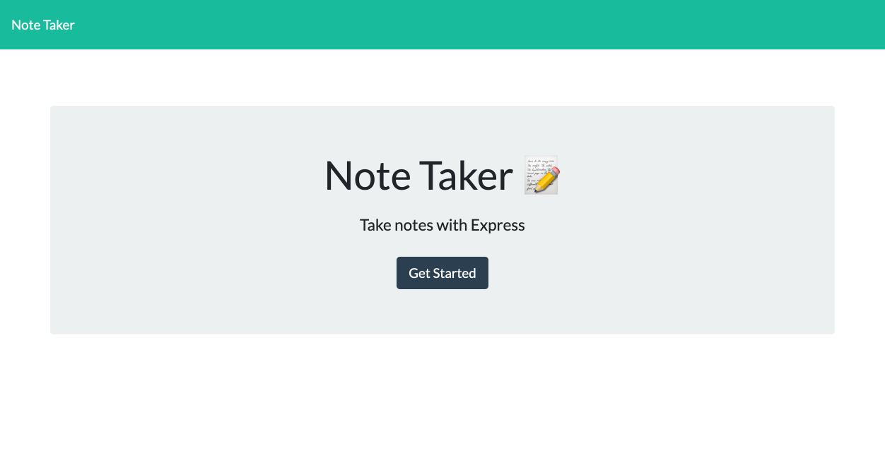
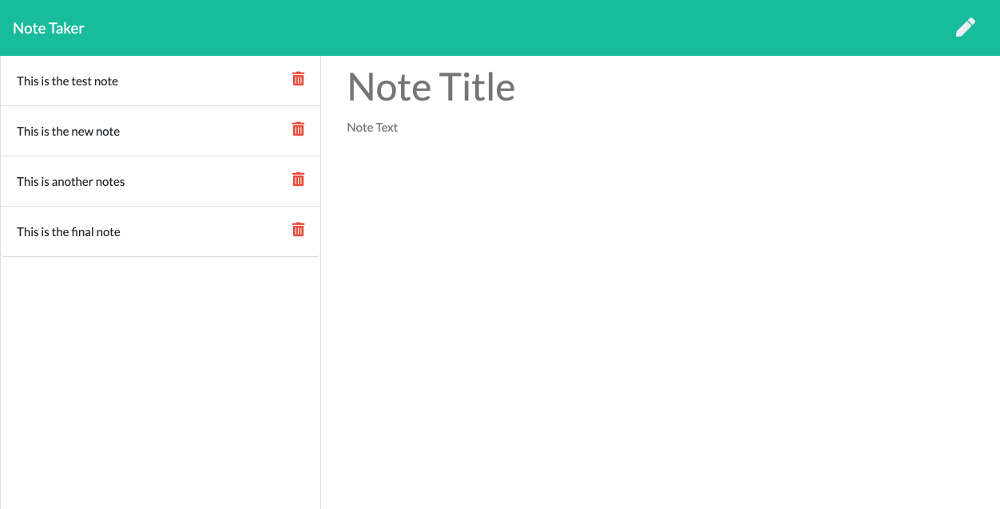

# Note-Taker

The purpose of this assignment is to create an web application for users to be able to write, save, and delete notes. For the users who need to keep a lot of important information, notes are helpful for memorizing. This application uses a JSON file as database so that every note the users what to keep can be saved to database persistently. The npm EXPRESS package is used in this application as the backend to connect between clients and server.

## Acceptance Criteria

```
Application should allow users to create and save notes.
Application should allow users to view previously saved notes.
Application should allow users to delete previously saved notes.
```

## Functionality and Appearance

Below is the start page and notes-working page of the application:



Here is the deployed link of the application: [Notes Taker App](https://notes-generator.herokuapp.com/)

